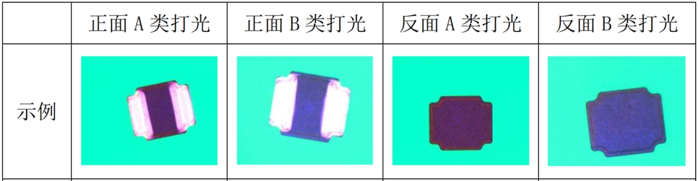
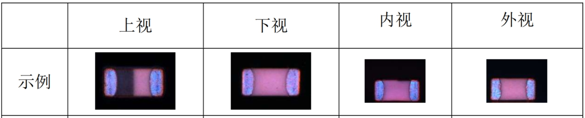
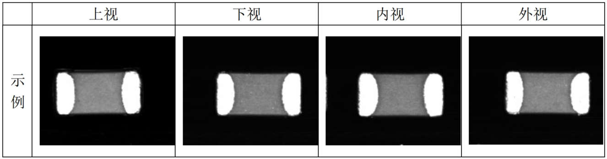
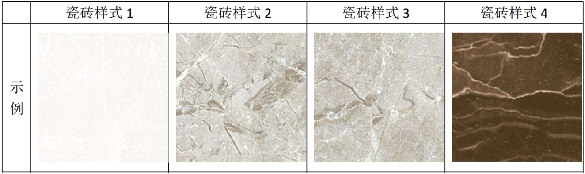
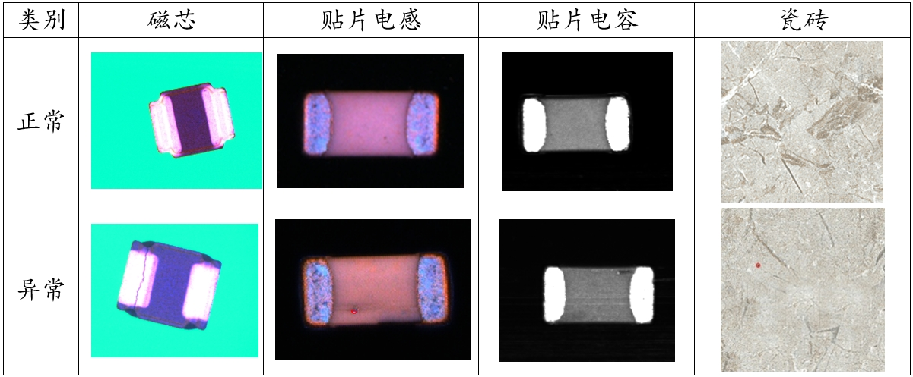
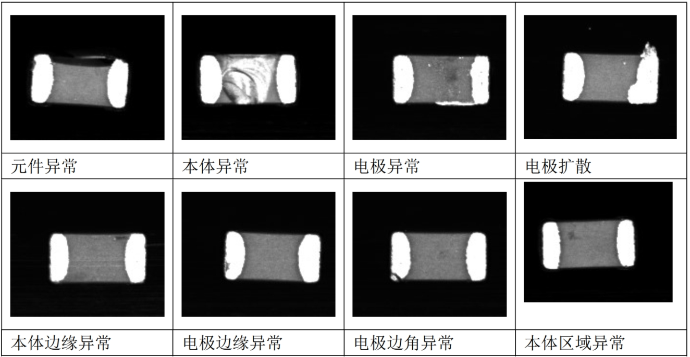
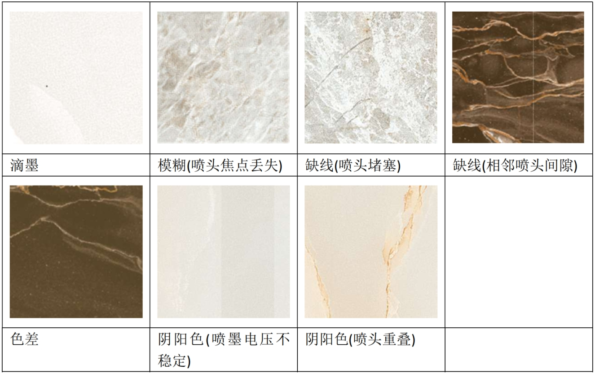

# MV-AD2025：An Industrial Surface Defect Dataset

[](https://creativecommons.org/licenses/by-nc-sa/4.0/)


面向工业质检的多光照多视角缺陷检测基准数据集 | [Download](#[https://pan.baidu.com/s/1C-7WtgGpwg992elSjtcWwg?pwd=si41])

提取码: si41 

磁芯

贴片电感

贴片电容

瓷砖




## 特色亮点
✅ **数据多样性**：涵盖4类工业对象（磁芯、贴片电感、贴片电容和瓷砖）  
✅ **复杂缺陷形态**：每类7-9种真实缺陷类别，总计31种缺陷类别  
✅ **成像多样性**：多角度（1-4个观测面）与多光源（明场/暗场/低角度）组合  
✅ **高精度标注**：提供像素级分割掩膜标注  
✅ **细粒度标注**：提供细粒度的抽象语义属性标签  

## 数据集结构

```InduDefect
├── Category1_MagneticCore
│ ├── Image
│   ├── Good # 正常样本
│   └── NG # 缺陷样本
├── Category2_ChipInductor
├── Category3_ChipCapacitor
└── Category4_CeramicTile
```

## 数据集组成
| 目标对象         | 总样本量 | 缺陷类型 | 成像组合  | 
|------------------|-----------|----------|-----------|
| 磁芯             | 45,121    | 7        | 2面×4光源 |
| 贴片电感         | 72,879    | 9        | 4面×4光源 |
| 贴片电容         | 20,888    | 8        | 3面×3光源 |
| 瓷砖             | 14,000    | 7        | 1面×1光源 |

## 样例图


## 缺陷类型示例
**磁芯缺陷**：
- 裂痕（线状/网状）
- 缺块
- 焊点缺陷
- 材料裂纹
- 氧化污染

**贴片电感缺陷**：
- 裂痕（线状/网状）
- 缺块
- 焊点缺陷
- 材料裂纹
- 氧化污染

**贴片电容缺陷**：
- 元件异常(形状缺陷)
- 本体异常(形状缺陷)
- 电极异常(形状缺陷)
- 电极扩散(形状缺陷)
- 本体边缘异常(纹理缺陷)
- 电极边缘异常(纹理缺陷)
- 电极边角异常(形状/纹理缺陷)
- 本体区域异常(纹理缺陷)


**瓷砖缺陷**：
- 滴墨
- 模糊(喷头焦点丢失)
- 缺线(喷头堵塞)
- 缺线(相邻喷头间隙)
- 色差
- 阴阳色(喷墨电压不稳定)
- 阴阳色(喷头重叠)


## 基准测试
支持以下评估模式：
```python
# 兼容MVTec评估协议
from benchmarks import mvtec_evaluation

# 示例结果（基于 ***  backbone）
| 类别        | AUROC  | F1 Score | PRO Score |
|-------------|--------|----------|-----------|
| 磁芯        | 98.2%  | 95.7%    | 96.8%     |
| 贴片电感    | 97.4%  | 93.2%    | 95.1%     |
使用许可
本数据集遵循 CC BY-NC-SA 4.0 协议：

✅ 允许学术研究使用

✅ 允许非商业性工程验证

❌ 禁止直接用于商业产品


引用
若使用本数据集，请引用：

bibtex
@misc{InduDefect2023,
  title={InduDefect: A Multi-Illumination Industrial Defect Benchmark},
  author={XJTU & SCUT MVLab},
  year={2025},
  howpublished={\url{https://github.com/your-repo}}
}
致谢
数据集由西安交通大学、华南理工大学、广州深视未来智能科技有限责任公司、肇庆市宏华电子科技有限公司共同发布。

相关项目：
MVTec AD | VisA | Real-IAD
